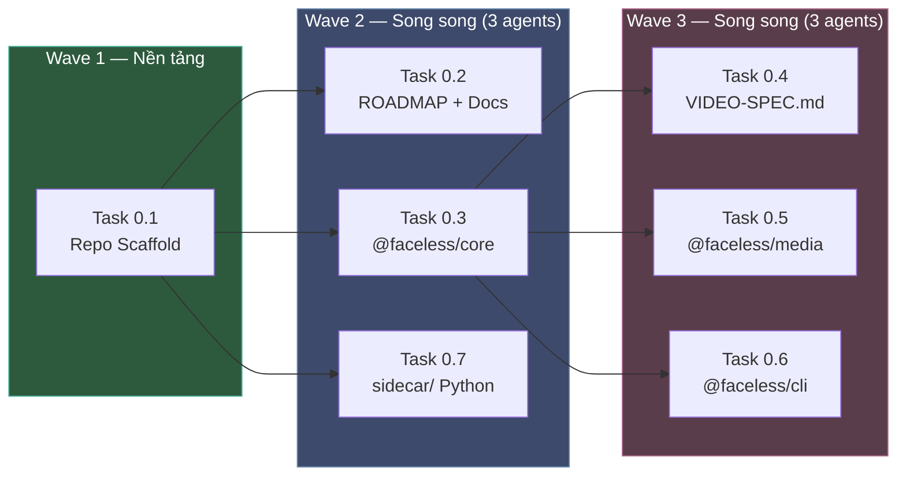

# Phase 0 — Orchestration Plan

## Goal
Điều phối 7 task của Phase 0 (đã approved trong [`docs/phase-0-plan.md`](file:///home/vcc/tuanlee/faceless-studio/docs/phase-0-plan.md)) bằng sub-agents chạy trên OpenCode (model giá rẻ). Tối ưu parallelism, đảm bảo code chất lượng qua review 2 lớp (self-check + orchestrator review).

## User Review Required

> [!IMPORTANT]
> **Quy trình phê duyệt:** Sau khi sub-agent hoàn thành task, bạn thu báo cáo nghiệm thu + code về session này. Tôi review code thực tế (không chỉ báo cáo) rồi trả **PASS** hoặc **REJECT + lý do**. Chỉ task PASS mới merge vào `main`.

> [!WARNING]
> **VieNeu-TTS chưa xác nhận.** Task 0.7 (sidecar) chỉ tạo stub. Spike TTS/Align hoãn sang khi có model. Nếu bạn đã có VieNeu → cho tôi biết, tôi sẽ cập nhật Task 0.7.

## Open Questions

Không còn — plan đã approved. Nếu sub-agent gặp mâu thuẫn trong tài liệu, họ sẽ ghi vào báo cáo thay vì tự quyết.

---

## Execution Schedule — 3 Waves



| Wave | Tasks | Agents cần | Ước lượng thời gian | Ghi chú |
|------|-------|-----------|---------------------|---------|
| **1** | 0.1 | 1 | 5–10 phút | Đơn giản nhất, chạy trước |
| **2** | 0.2, 0.3, 0.7 | 3 song song | 15–25 phút | 0.3 nặng nhất (schema + test) |
| **3** | 0.4, 0.5, 0.6 | 3 song song | 15–25 phút | Phụ thuộc 0.3 xong + PASS |

**Tổng ước lượng:** 35–60 phút (nếu không reject).

---

## Prompts cho Sub-Agents

### Wave 1 — Task 0.1

Paste vào 1 agent OpenCode:

````text
Bạn là sub-agent thực thi Task 0.1 của dự án Faceless Studio.

## Bước 1: Đọc luật
Đọc file `AGENTS.md` ở gốc repo. Ghi nhớ các quy tắc cross-platform và quy ước mã.

## Bước 2: Đọc plan
Đọc file `docs/phase-0-plan.md`, chỉ phần "Task 0.1 — Repo Scaffold & Cấu hình gốc".

## Bước 3: Thực thi
Tạo tất cả file trong bảng Deliverables, theo đúng nội dung hướng dẫn chi tiết.

## Bước 4: Tự nghiệm thu
Chạy từng mục trong "Tiêu chí tự nghiệm thu". Ghi kết quả vào file `docs/reports/task-0.1-report.md` theo mẫu "Báo cáo nghiệm thu" trong plan.

## Bước 5: Commit
```
git add -A
git commit -m "phase-0: task 0.1 — repo scaffold"
```

KHÔNG làm gì ngoài Task 0.1. Nếu gặp vấn đề, ghi vào báo cáo mục "Việc còn mở".
````

---

### Wave 2 — Task 0.2 (docs)

````text
Bạn là sub-agent thực thi Task 0.2 của dự án Faceless Studio.

## Bước 1: Đọc luật
Đọc file `AGENTS.md` ở gốc repo.

## Bước 2: Đọc plan
Đọc file `docs/phase-0-plan.md`, chỉ phần "Task 0.2 — Tài liệu gốc: ROADMAP.md + Doc Stubs".

## Bước 3: Đọc context
Đọc `README.md` (bảng "Bản đồ tài liệu") và `docs/ARCHITECTURE.md` toàn bộ.

## Bước 4: Thực thi
Tạo tất cả file trong bảng Deliverables. `docs/ROADMAP.md` phải viết đầy đủ (KHÔNG stub).
Các file khác (PIPELINE, TEMPLATES-AND-TOPICS, v.v.) là stub có header + TODO.

## Bước 5: Tự nghiệm thu
Chạy từng mục trong "Tiêu chí tự nghiệm thu". Ghi kết quả vào `docs/reports/task-0.2-report.md`.

## Bước 6: Commit
```
git add -A
git commit -m "phase-0: task 0.2 — roadmap and doc stubs"
```

KHÔNG làm gì ngoài Task 0.2.
````

---

### Wave 2 — Task 0.3 (core schemas)

````text
Bạn là sub-agent thực thi Task 0.3 của dự án Faceless Studio.

## Bước 1: Đọc luật
Đọc file `AGENTS.md` ở gốc repo. Đặc biệt chú ý:
- Luật vàng #1: Spec là hợp đồng
- Luật vàng #3: Neo theo từ, không theo giây
- Quy ước mã: core KHÔNG import React, Remotion, browser API

## Bước 2: Đọc plan
Đọc file `docs/phase-0-plan.md`, chỉ phần "Task 0.3 — packages/core: Scaffold + Zod Schemas".

## Bước 3: Đọc context
Đọc `docs/ARCHITECTURE.md` mục 5 (Thư mục project), mục 8 (Ranh giới mở rộng), ADR-003.

## Bước 4: Thực thi
Tạo package `@faceless/core` với tất cả file trong bảng Deliverables.
Code mẫu có sẵn trong plan — dùng làm base, điều chỉnh nếu cần nhưng KHÔNG đổi schema shape.

## Bước 5: Tự nghiệm thu
```bash
cd packages/core
pnpm install
pnpm build
pnpm test
grep -rn "from 'react\|from 'remotion\|from '@remotion\|window\.\|document\." src/
```
Ghi kết quả vào `docs/reports/task-0.3-report.md`.

## Bước 6: Commit
```
git add -A
git commit -m "phase-0: task 0.3 — @faceless/core schemas and interfaces"
```

KHÔNG làm gì ngoài Task 0.3. KHÔNG tạo docs/VIDEO-SPEC.md (đó là Task 0.4).
````

---

### Wave 2 — Task 0.7 (sidecar)

````text
Bạn là sub-agent thực thi Task 0.7 của dự án Faceless Studio.

## Bước 1: Đọc luật
Đọc file `AGENTS.md` ở gốc repo. Chú ý: không viết .sh/.bat.

## Bước 2: Đọc plan
Đọc file `docs/phase-0-plan.md`, chỉ phần "Task 0.7 — sidecar/ Scaffold (Python/uv)".

## Bước 3: Thực thi
Tạo 4 file: pyproject.toml, tts.py, align.py, README.md.
Code mẫu có sẵn trong plan.

## Bước 4: Tự nghiệm thu
```bash
cd sidecar
# Test TTS stub
echo '[{"id":"j1","text":"Xin chào thế giới","voice":"default"}]' > /tmp/test-tts-jobs.json
python3 tts.py /tmp/test-tts-jobs.json

# Test Align stub
echo '{"audioPath":"test.wav","text":"Xin chào thế giới","lang":"vi"}' > /tmp/test-align.json
python3 align.py /tmp/test-align.json

# Test error handling
python3 tts.py 2>&1
python3 align.py 2>&1
```
Ghi kết quả vào `docs/reports/task-0.7-report.md`.

## Bước 5: Commit
```
git add -A
git commit -m "phase-0: task 0.7 — sidecar python stubs"
```

KHÔNG làm gì ngoài Task 0.7.
````

---

### Wave 3 — Task 0.4 (VIDEO-SPEC.md)

````text
Bạn là sub-agent thực thi Task 0.4 của dự án Faceless Studio.

## Bước 1: Đọc luật
Đọc `AGENTS.md`, luật vàng #1: "Spec là hợp đồng".

## Bước 2: Đọc plan
Đọc `docs/phase-0-plan.md`, phần "Task 0.4".

## Bước 3: Đọc source of truth
Đọc `packages/core/src/schemas/video-spec.ts` — đây là schema zod thực tế.
Tài liệu bạn viết PHẢI khớp 1:1 với file này.

## Bước 4: Thực thi
Tạo `docs/VIDEO-SPEC.md`:
1. Header: specVersion, mục đích
2. Bảng tổng quan từng trường top-level
3. Mục chi tiết cho mỗi nested object
4. Ví dụ JSON tối thiểu (lấy từ test fixture trong schemas.test.ts)
5. Quy tắc (neo theo từ, versioning, license)
6. Changelog

## Bước 5: Tự nghiệm thu
So sánh từng trường: schema → doc, doc → schema. Không thừa, không thiếu.
Ghi vào `docs/reports/task-0.4-report.md`.

## Bước 6: Commit
```
git add -A
git commit -m "phase-0: task 0.4 — VIDEO-SPEC.md"
```
````

---

### Wave 3 — Task 0.5 (media)

````text
Bạn là sub-agent thực thi Task 0.5 của dự án Faceless Studio.

## Bước 1: Đọc luật
Đọc `AGENTS.md`.

## Bước 2: Đọc plan
Đọc `docs/phase-0-plan.md`, phần "Task 0.5".

## Bước 3: Đọc context
- `packages/core/src/types.ts` và `packages/core/src/interfaces.ts` — các interface cần implement.
- `docs/ARCHITECTURE.md` mục 8, mục 10.

## Bước 4: Thực thi
Tạo package `@faceless/media` theo bảng Deliverables. Code mẫu trong plan.

## Bước 5: Tự nghiệm thu
```bash
cd packages/media
pnpm install
pnpm build
pnpm test
grep -rn "from 'react\|from 'remotion" src/
```
Ghi vào `docs/reports/task-0.5-report.md`.

## Bước 6: Commit
```
git add -A
git commit -m "phase-0: task 0.5 — @faceless/media scaffold"
```
````

---

### Wave 3 — Task 0.6 (cli + doctor)

````text
Bạn là sub-agent thực thi Task 0.6 của dự án Faceless Studio.

## Bước 1: Đọc luật
Đọc `AGENTS.md` (lệnh chính, cross-platform).

## Bước 2: Đọc plan
Đọc `docs/phase-0-plan.md`, phần "Task 0.6".

## Bước 3: Thực thi
Tạo package `@faceless/cli` với `studio doctor`. Code mẫu trong plan.
KHÔNG thêm thư viện CLI parser (yargs, commander). Dùng `process.argv`.

## Bước 4: Tự nghiệm thu
```bash
cd packages/cli
pnpm install
pnpm build
pnpm test

# Integration test
node dist/main.js doctor
node dist/main.js doctor --json
node dist/main.js doctor --json | python3 -c "import sys,json; d=json.load(sys.stdin); print('OK' if 'checks' in d and 'allPassed' in d else 'FAIL')"
```
Ghi vào `docs/reports/task-0.6-report.md`.

## Bước 5: Commit
```
git add -A
git commit -m "phase-0: task 0.6 — @faceless/cli studio doctor"
```
````

---

## Review Protocol — Quy trình tôi review

Khi bạn gửi báo cáo nghiệm thu về, tôi sẽ kiểm tra theo thứ tự:

### 1. Compliance check (tự động)
```bash
# AGENTS.md rules
grep -rn "from 'react\|from 'remotion\|from '@remotion" packages/core/src/ packages/media/src/
# Phải trống

# Cross-platform: không exec(), chỉ execFile()
grep -rn "exec(" packages/  --include="*.ts" | grep -v "execFile\|execFileAsync"
# Phải trống (hoặc chỉ có TODO comments)

# File naming
find packages/ sidecar/ -name "*[A-Z]*" -o -name "* *" | grep -v node_modules | grep -v .gitkeep
# Phải trống (kebab-case only, trừ file config chuẩn)

# .gitattributes
head -1 .gitattributes
# Phải là: * text=auto eol=lf
```

### 2. Build & Test
```bash
pnpm install
pnpm build     # exit 0?
pnpm test      # all green?
```

### 3. Schema ↔ Doc cross-check (Task 0.3 + 0.4)
- Mỗi trường trong zod schema → có trong VIDEO-SPEC.md
- Mỗi trường trong VIDEO-SPEC.md → có trong zod schema
- Ví dụ JSON trong doc → `VideoSpecSchema.parse()` thành công

### 4. Integration smoke test
```bash
node packages/cli/dist/main.js doctor --json | jq .allPassed
# → true hoặc false (nhưng JSON phải valid)
```

### 5. Verdict

| Kết quả | Hành động |
|---------|-----------|
| **PASS** | Merge commit, chuyển wave tiếp |
| **PASS with notes** | Merge, ghi TODO cho phase sau |
| **REJECT** | Ghi lý do cụ thể + file/dòng cần sửa, trả lại sub-agent |

---

## Conflict Resolution

Nếu 2 task trong cùng wave sửa cùng file (ví dụ cả 0.2 và 0.3 đều muốn tạo `packages/core/`):

1. Task có số nhỏ hơn merge trước.
2. Task sau rebase lên.
3. Nếu conflict thực sự (logic mâu thuẫn) → tôi resolve thủ công.

**Trường hợp thực tế Phase 0:** không có conflict vì mỗi task tạo file riêng biệt.

---

## Verification Plan

### Automated Tests
Sau khi tất cả 7 tasks PASS:

```bash
# Full integration checklist
pnpm install && pnpm build && pnpm test
node packages/cli/dist/main.js doctor --json
ls docs/ROADMAP.md docs/VIDEO-SPEC.md docs/PIPELINE.md
python3 sidecar/tts.py 2>&1 | head -1
python3 sidecar/align.py 2>&1 | head -1
cat .gitattributes
```

### Manual Verification
Bạn nên verify:
1. `studio doctor` output nhìn đúng trên terminal (emoji, format).
2. `docs/ROADMAP.md` nội dung đầy đủ, đọc hiểu được.
3. `docs/VIDEO-SPEC.md` mô tả đúng cấu trúc spec.json.

---

## Post-Phase 0

Sau khi Phase 0 PASS:
```bash
git tag phase-0-done
```

Tôi sẽ tạo walkthrough artifact tổng kết và lên plan cho Phase 1.
