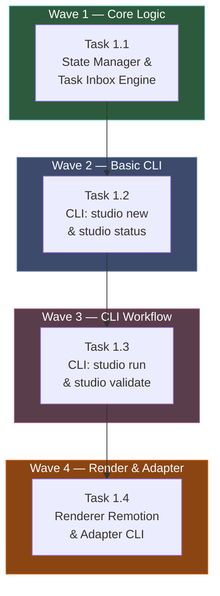

# Phase 1 — Core Pipeline: Execution & Orchestration Plan

> **Dự án:** Faceless Studio
> **Phase:** 1 — Pipeline cốt lõi (Script → Spec → Render khung)
> **Mục tiêu:** Tạo project (`new`), quản lý state (`status`), chạy workflow (`run`, `validate` qua Task Inbox), và kết xuất video 16:9 cơ bản (`render`).
> **Ngày tạo:** 2026-10-05

## Quy ước cho sub-agent

1. **Tuân thủ AGENTS.md tuyệt đối:** Không React trong core, không shell/bat, tên file kebab-case, path dùng `node:path`.
2. **Kế thừa Phase 0:** Dùng lại `zod` schemas trong `@faceless/core`.
3. **Vitest:** Mọi logic xử lý file/state/task phải có test cover.

---

## Sơ đồ phụ thuộc (Waves)



---

## Chi tiết Task

### Task 1.1 — `@faceless/core`: State Manager & Task Inbox

**Bối cảnh:** `docs/ARCHITECTURE.md` mục 5 (Project folder) & mục 6 (Task Inbox).
**Package:** `packages/core`

**Yêu cầu:**
1. Tạo class `ProjectManager` quản lý vòng đời thư mục:
   - `createProject(slug, config)`: Tạo thư mục, ghi `project.json`, `state.json` (pending tất cả stages), tạo folder `tasks/`, `results/`, `script/`, v.v.
   - `getState(slug)`: Đọc `state.json`.
   - `updateStage(slug, stage, patch)`: Cập nhật status của một stage (pending, running, done, failed).
2. Tạo module `TaskInbox`:
   - `createTask(slug, id, stage, skill, inputs, output, schema, prompt)`: Ghi file `tasks/<id>-<stage>.md` với frontmatter yaml hợp lệ (cần parse/stringify yaml thủ công hoặc dùng lib nhẹ như `js-yaml` - *nếu dùng lib, phải thêm vào dependencies*).
   - `validateResult(slug, taskId, schema)`: Đọc file `results/...json`, gọi `schema.parse()`. Nếu pass: đổi status stage thành `done`. Nếu fail: tạo file `results/...errors.md` ghi chi tiết lỗi zod để agent sửa.
3. Test bằng Vitest trên thư mục `/tmp/faceless-test-...`.

**Tiêu chí tự nghiệm thu:**
- Test cho `ProjectManager` và `TaskInbox` chạy xanh (tạo file thực tế trên đĩa).
- Báo cáo vào `docs/reports/task-1.1-report.md`.

---

### Task 1.2 — `@faceless/cli`: Lệnh `new` và `status`

**Bối cảnh:** `AGENTS.md` (mục Lệnh chính).
**Package:** `packages/cli`

**Yêu cầu:**
1. Mở rộng `packages/cli/src/main.ts` để nhận thêm 2 lệnh:
   - `studio new <slug> --topic <t> --template <tp> --minutes <m> --formats <f>`
   - `studio status <slug> [--json]`
2. Implement `new`: Gọi `ProjectManager.createProject()` từ Task 1.1. In thông báo thành công hoặc lỗi nếu tồn tại.
3. Implement `status`: Đọc `getState()` và in ra bảng terminal màu (hoặc JSON nguyên bản nếu có cờ `--json`).
4. Test: Thêm test integration chạy CLI để xác minh stdout. (Lưu ý: parse arg CLI bằng tay hoặc dùng lệnh parse đơn giản).

**Tiêu chí tự nghiệm thu:**
- Lệnh chạy không lỗi. In JSON hợp lệ khi có `--json`.
- Báo cáo vào `docs/reports/task-1.2-report.md`.

---

### Task 1.3 — `@faceless/cli`: Lệnh `run` và `validate`

**Bối cảnh:** `AGENTS.md` (mục Lệnh chính), Task Inbox workflow.
**Package:** `packages/cli`

**Yêu cầu:**
1. Thêm lệnh `studio validate <slug>`: Quét thư mục `results/`, tìm các JSON ứng với Task, gọi `TaskInbox.validateResult()`. In ra log PASSED hoặc FAILED kèm nguyên nhân. Cập nhật `state.json`.
2. Thêm lệnh `studio run <slug> [stage]`:
   - Nếu `stage` là một bước sáng tạo (ví dụ `outline`, `script`, `direct`): Chuyển state sang `running`, sinh ra file task markdown bằng `TaskInbox.createTask()`, và in ra màn hình: `"Task generated. Agent must fulfill results/... then run studio validate."`
   - Nếu `stage` là bước tất định (ví dụ `tts`, `align`): Gọi client MockTts/MockAlign từ `packages/media`, sinh ra audio mock, update state thành `done`.
3. Test integration.

**Tiêu chí tự nghiệm thu:**
- Chuỗi lệnh `new` -> `run outline` -> tạo kết quả giả (bằng fs.writeFileSync trong test) -> `validate` chạy thành công.
- Báo cáo vào `docs/reports/task-1.3-report.md`.

---

### Task 1.4 — `@faceless/renderer-remotion` và `studio render`

**Bối cảnh:** `docs/ARCHITECTURE.md` ADR-001 (Remotion).
**Package:** `packages/renderer-remotion` (mới) và `packages/cli`

**Yêu cầu:**
1. Tạo package `@faceless/renderer-remotion` chứa code Remotion rỗng (không cần UI phức tạp, chỉ cần render một component `<HelloWorld>` đơn giản nhận `VideoSpec` làm prop, hiển thị chữ trắng nền đen).
2. Viết class implement interface `RendererAdapter` (từ `@faceless/core`) bọc lệnh gọi `@remotion/bundler` và `@remotion/renderer`.
   *Chú ý:* Yêu cầu cài thêm `@remotion/bundler`, `@remotion/renderer`, `remotion`, `react`, `react-dom` cho CỤC BỘ package này. (Luật AGENTS.md vẫn cấm React trong `core`).
3. Mở rộng CLI `studio render <slug> --format <f>`:
   - Đọc `spec.json`.
   - Gọi `RendererAdapter.render()`.
   - Xuất file `.mp4` vào `projects/<slug>/out/`.

**Tiêu chí tự nghiệm thu:**
- `pnpm build` cả workspace không lỗi.
- Lệnh `studio render` chạy ra 1 file mp4 có thể mở được (hiển thị text chữ).
- Báo cáo vào `docs/reports/task-1.4-report.md`.

---

## Quy trình Orchestrator Review

1. Tương tự Phase 0: Bạn paste prompt (bên dưới) cho từng sub-agent ở OpenCode.
2. Thu báo cáo nghiệm thu về session hiện tại.
3. Tôi sẽ review code thực tế, chạy integration test và trả PASS / REJECT.

---

## Prompts cho Sub-Agents (Copy-Paste)

### Task 1.1 Prompt
```text
Bạn là sub-agent thực thi Task 1.1 của dự án Faceless Studio.
1. Đọc luật ở `AGENTS.md`.
2. Đọc plan ở `docs/phase-1-plan.md` phần "Task 1.1".
3. Thực thi: Thêm dependencies nếu cần (ví dụ: `yaml` hoặc `js-yaml` vào package core). Code `ProjectManager` và `TaskInbox`. Viết Vitest.
4. Chạy `cd packages/core && pnpm test` và báo cáo kết quả vào `docs/reports/task-1.1-report.md`.
5. Commit: `git add -A && git commit -m "phase-1: task 1.1 - state manager and task inbox"`
```

### Task 1.2 Prompt
```text
Bạn là sub-agent thực thi Task 1.2 của dự án Faceless Studio.
1. Đọc luật ở `AGENTS.md`.
2. Đọc plan ở `docs/phase-1-plan.md` phần "Task 1.2".
3. Tích hợp `ProjectManager` vào `packages/cli/src/main.ts`. Xử lý lệnh `new` và `status`.
4. Chạy test và tạo báo cáo `docs/reports/task-1.2-report.md`.
5. Commit: `git add -A && git commit -m "phase-1: task 1.2 - studio new and status"`
```

### Task 1.3 Prompt
```text
Bạn là sub-agent thực thi Task 1.3 của dự án Faceless Studio.
1. Đọc luật ở `AGENTS.md`.
2. Đọc plan ở `docs/phase-1-plan.md` phần "Task 1.3".
3. Thêm lệnh `run` và `validate` vào CLI. Gọi MockTTS/MockAlign nếu stage là TTS/Align. Tạo file task nếu stage là sáng tạo.
4. Chạy test và tạo báo cáo `docs/reports/task-1.3-report.md`.
5. Commit: `git add -A && git commit -m "phase-1: task 1.3 - studio run and validate"`
```

### Task 1.4 Prompt
```text
Bạn là sub-agent thực thi Task 1.4 của dự án Faceless Studio.
1. Đọc luật ở `AGENTS.md` (chú ý: được phép dùng React ở renderer-remotion, CẤM trong core).
2. Đọc plan ở `docs/phase-1-plan.md` phần "Task 1.4".
3. Khởi tạo `packages/renderer-remotion`, implement `RendererAdapter`. Cập nhật CLI lệnh `render`.
4. Chạy render thử và tạo báo cáo `docs/reports/task-1.4-report.md`.
5. Commit: `git add -A && git commit -m "phase-1: task 1.4 - remotion renderer setup"`
```
